# 一、小组个人信息

组长：  
组员：  
组员：  
组员：  
组员：  

# 二、项目概况

## （一）任务目标

本招聘网站项目的主要目标包括：

1. **用户注册与登录**：实现用户（求职者和招聘方）注册、登录、以及账户管理功能，包括用户信息的增删改查。
2. **职位发布与管理**：招聘方可以发布和管理职位信息，包括职位的分类、描述、要求等，并能够编辑和删除职位。
3. **求职功能**：求职者可以浏览、搜索并申请职位，并能够查看申请状态和历史记录。
4. **简历管理**：求职者可以创建、编辑简历。
5. **通知与消息**：系统提供通知功能，向用户推送招聘进展、面试安排等消息，同时提供站内消息功能，方便用户之间的交流。
6. **推荐系统**：实现职位推荐和简历推荐功能，帮助招聘方和求职者更快匹配合适的工作和人才。
7. **安全性与隐私保护**：保证用户数据的安全性和隐私保护，采用加密算法进行数据存储，防止数据泄露和滥用。
8. **用户体验**：提供良好的用户界面和用户体验，使用户能够方便快捷地完成所有操作。

## （二）用户特点

本系统的最终用户主要分为三类：求职者、招聘方和管理员。

- **求职者**：
  - 注册并创建个人账号。
  - 浏览和搜索职位信息。
  - 投递简历和查看申请进度。
  - 接收面试通知和系统推荐的职位信息。

- **招聘方**：
  - 注册并创建公司账号。
  - 发布和管理招聘职位。
  - 浏览和筛选求职者简历。
  - 通知求职者面试安排和录用信息。

- **管理员**：

  - 系统的整体管理与维护。
  - 管理用户账号，包括求职者和招聘方的注册申请审核、账号启用和禁用。
  - 监控系统运行状态，确保系统稳定和安全。
  - 审核和管理招聘信息，确保职位信息的合法性和真实性。
  - 处理用户反馈和投诉，提供技术支持。
  - 生成系统报告和统计数据，提供给决策层参考。

## （三）假定与约束

1. 系统运行的最小寿命：在无重大改动的情况下运行 3 年。  
2. 开发期限：120 天。  
3. 假设相关硬件设备齐全。  
4. 假设系统相关功能达到预期要求。  
5. 系统必须遵守数据保护和隐私法规，支持高并发访问，确保在用户高峰期依然能够稳定运行。  
6. 系统需要满足网络安全和信息安全的相关规定和要求，包括但不限于防止黑客攻击、数据泄露等方面的规定。

# 三、需求分析

## （一）业务描述

### 1.系统总业务流程图及其描述

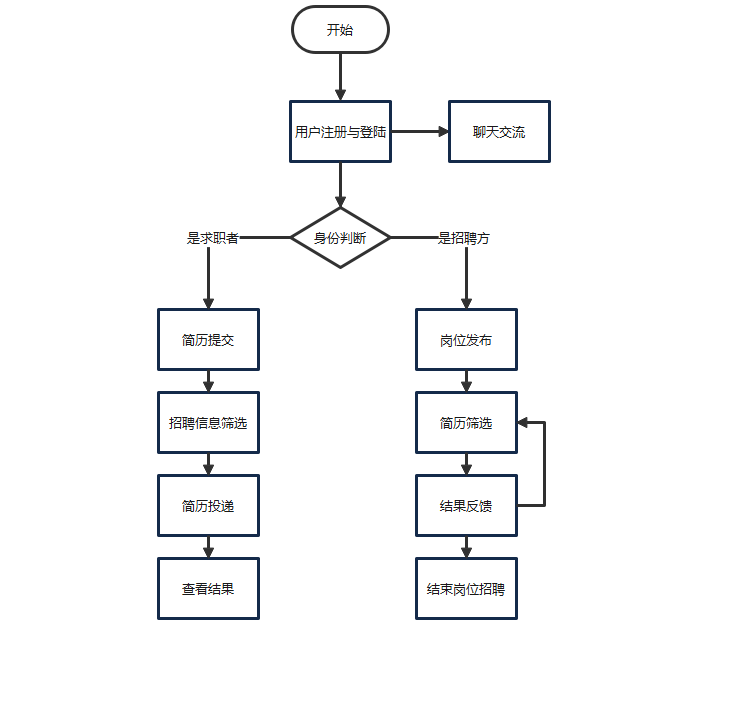

上述总业务流程图概述了招聘平台的核心操作流程。用户首先在平台上注册并登录，随后根据其身份（求职者或招聘方）进入不同的操作路径。求职者可以提交简历并根据个人条件筛选并申请职位，而招聘方则负责发布岗位需求并对收到的简历进行筛选。双方通过平台进行互动，求职者投递简历后，招聘方会根据岗位要求进行评估并给出反馈。这个过程不断进行，直到招聘方找到合适的候选人并结束岗位的招聘。此外，无论用户是求职者还是招聘方，都可以在聊天系统与他人交流、分享职位信息。

### 2.各个子业务流程图及其描述

#### （1）注册登录

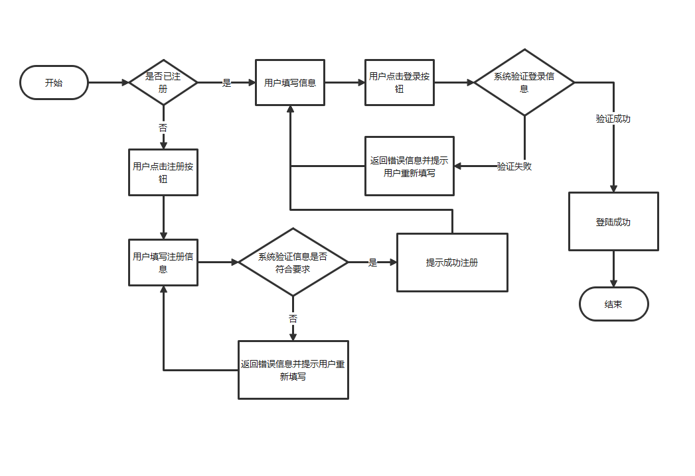

这张业务流程图展示了用户在进行登录和注册操作时的系统响应流程。当用户访问系统时，首先需要自行判断是否已经注册。如果已注册，用户将点击登录按钮并输入个人信息，系统随后验证这些信息。如果登录信息正确，用户将成功登录；如果不正确，系统会提示错误并要求用户重新填写。对于未注册的用户，他们将选择注册按钮并填写注册信息。系统将检查这些信息是否符合注册要求，如果符合，用户将被告知注册成功；如果不符合，系统同样会返回错误信息并要求用户重新填写。

#### （2）求职者
- 个人信息管理与简历编辑

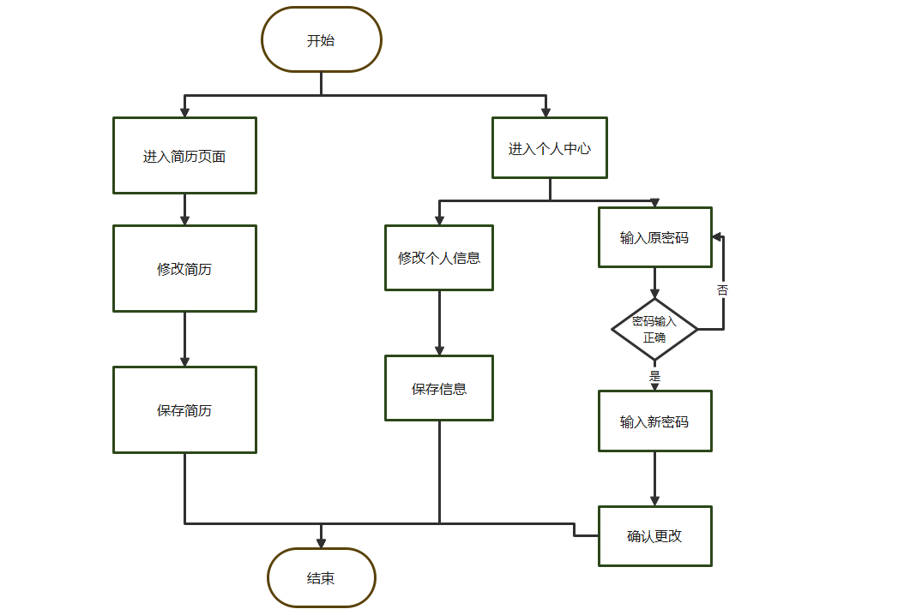

在求职者登陆后，可以进入个人中心，修改姓名、性别等个人信息。也可以进入修改密码界面，输入原密码确认成功后，可以输入新密码并确认密码，确认更改后保存新密码。此外，还可以访问简历编辑页面，编辑个人简历并保存。

- 投递简历

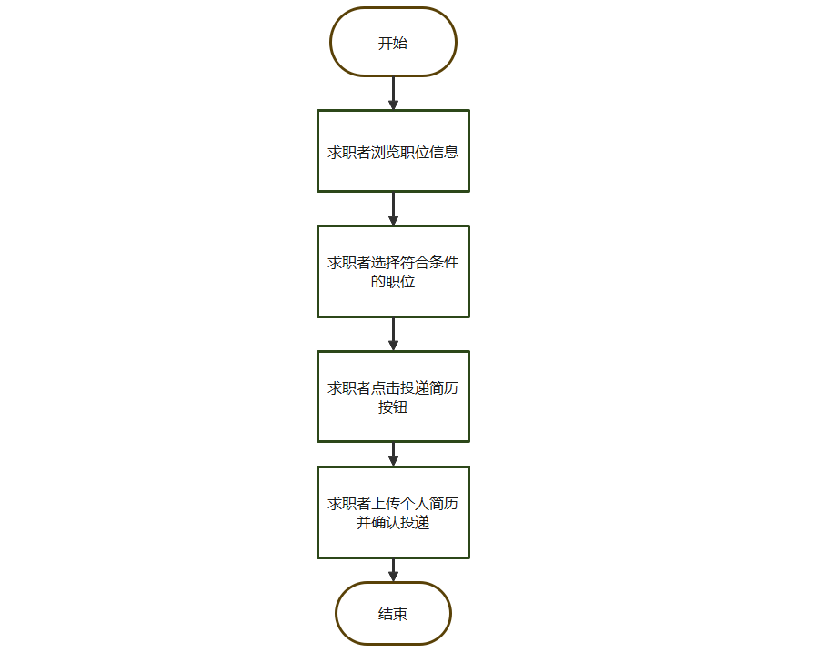

求职者首先浏览各种职位信息，寻找与自己资质和兴趣相匹配的岗位。一旦找到合适的职位，他们会点击投递简历的按钮，随后确认投递自己的个人简历。一旦投递完成，流程即告结束，求职者的简历便会被发送至招聘方进行审核。

#### （3）招聘方

- 个人信息管理

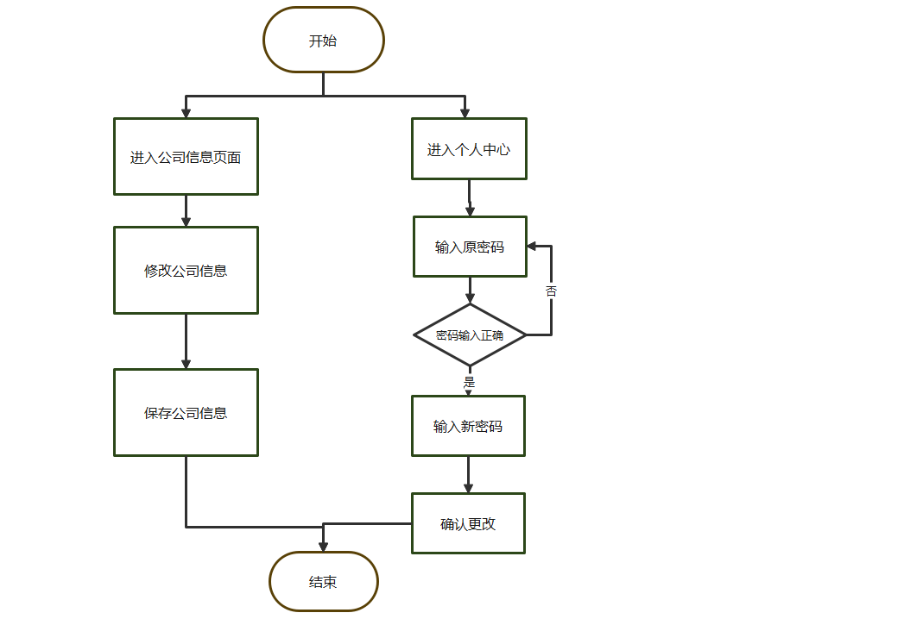

在招聘方登陆后，可以进入个人中心，修改密码，输入原密码确认成功后，可以输入新密码并确认密码，确认更改后保存新密码。此外，还可以访问公司信息编辑页面，编辑公司信息并保存。

- 职位发布

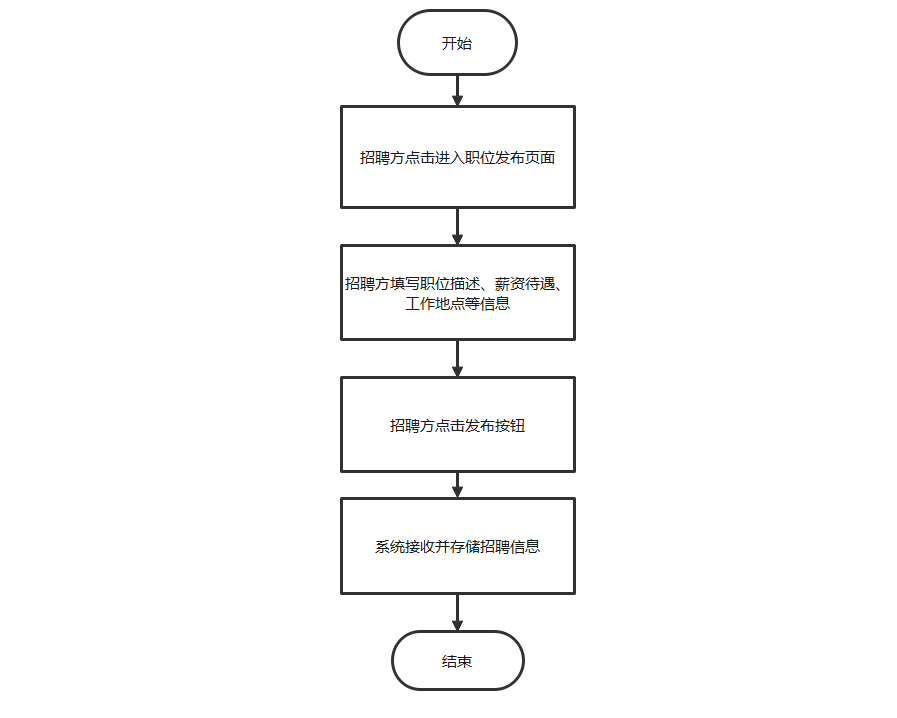

招聘方首先进入职位发布页面，然后详细填写包括职位描述、薪资待遇和工作地点在内的关键信息。点击发布按钮后，系统便会自动接收并存储这些信息。

- 招聘结果反馈

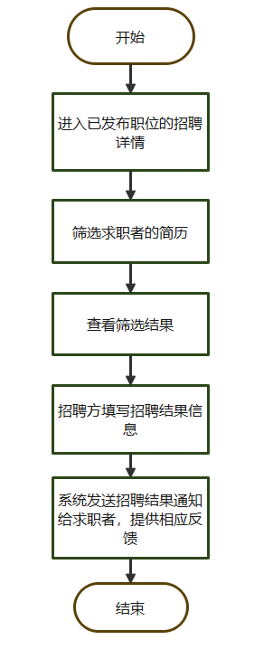

招聘方选择要查看详情的已发布职位，然后查看求职者的简历，然后填写相应的招聘结果反馈信息，例如录取、拒绝、进一步面试安排等。系统随后自动发送这些信息给求职者，并提供反馈，确保求职者及时了解申请结果。

- 管理已发布职位

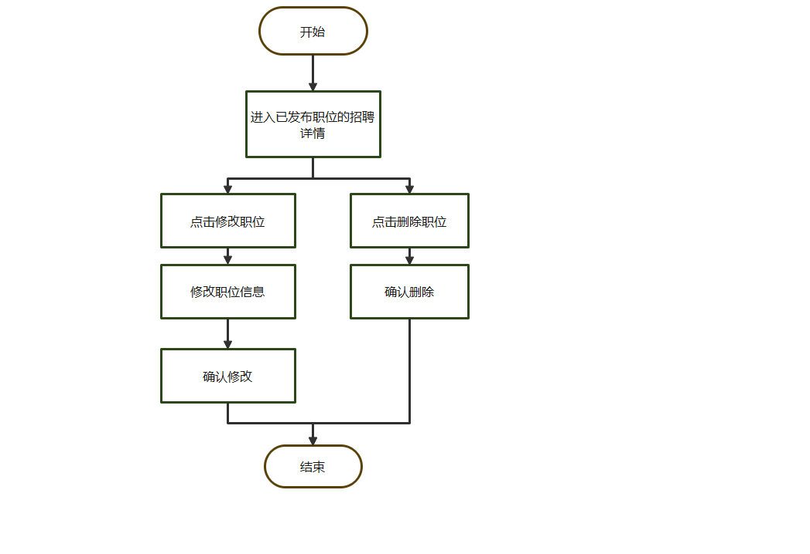

招聘方首先进入系统查看已发布的职位列表，然后选择需要操作的职位。如果需要修改职位信息，点击修改按钮，进入编辑页面进行编辑，并在完成后确认修改。如果招聘方决定删除某个职位，则点击删除按钮，系统会弹出确认对话框以避免误操作。一旦招聘方确认删除或修改，流程结束，职位信息将相应地更新或从系统中移除。

## （二）数据需求

### 1.数据需求描述

(1) 用户（包括求职者、招聘方）信息，用于满足用户浏览和修改个人信息的需求。  
(2) 职位信息，用于用户查看职位。  
(3) 求职信息，用于满足求职者投递简历、招聘方查看求职者简历的需求。  
(4) 聊天记录信息，用于记录用户间交流信息。

### 2.数据流图

用户信息数据流图如下：

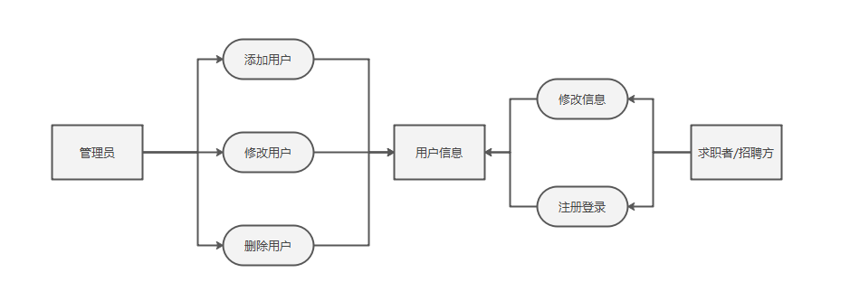

职位信息数据流图如下：

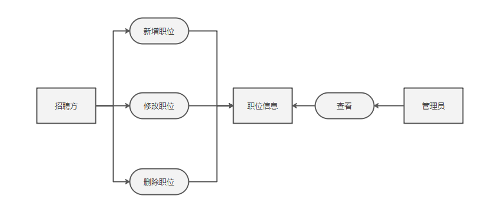

求职信息数据流图如下：

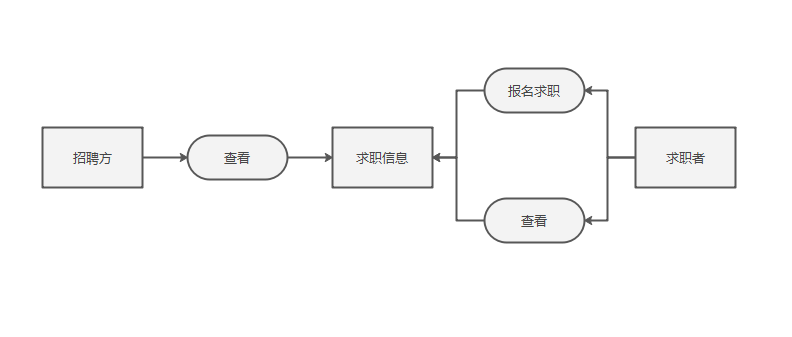

聊天记录信息数据流图如下：

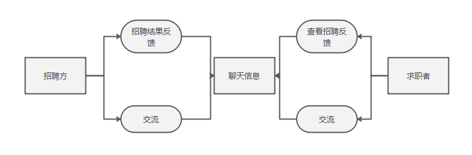

### 3.数据字典

**(1) 求职者信息表（）**   
求职者 ID（）：唯一标识符，自增长。  
求职者姓名（Name）：字符串，最大长度为 50。  
性别（Gender）：字符串，最大长度为 10。  
......（包含简历信息）  
**(2) 招聘方信息表（）**  
招聘方 ID（）：唯一标识符，自增长。  
招聘方姓名（Name）：字符串，最大长度为 50。  
性别（Gender）：字符串，最大长度为 10。  
......  
**(3) 管理员信息表（Admin）**  
管理员 ID（AdminID）：唯一标识符，自增长。  
管理员姓名（Name）：字符串，最大长度为 50。  
性别（Gender）：字符串，最大长度为 10。  
联系方式（Contact）：字符串，最大长度为   
**(4) 职位信息表（）**  
职位 ID（）：唯一标识符，自增长。  
......    
**(5) 求职信息表（Registration）**  
报名 ID（RegistrationID）：唯一标识符，自增长。  
求职者 ID（）：外键，关联求职者信息表中的求职者 ID。  
职位 ID（）：外键，关联职位信息表中的职位 ID。  
......  
**（6）聊天信息记录表**  
......

## （三）功能需求

功能划分为以下四个部分：

1. **用户管理模块**  
- **用户注册和登录**：  
求职者、招聘方和管理员可以通过系统注册账号，并填写个人信息。注册完成后可通过账号和密码登录系统。  
- **个人信息管理**：  
用户可以查看和修改自己的个人信息，包括姓名、联系方式等。  
- **用户权限管理**：  
管理员可以设置不同用户的权限，确保各类用户只能访问和操作相应的功能。
2. **求职者功能模块**  
- **职位浏览和搜索**：  
求职者可以浏览和搜索招聘信息，按职位类别、公司、地点等条件筛选职位。  
- **简历管理**：  
求职者可以在线创建、编辑和管理简历，上传附件等。  
- **职位申请**：  
求职者可以投递简历至感兴趣的职位，并查看申请状态。  
- **职位推荐**：  
系统根据求职者的简历和求职意向，推荐适合的职位信息。  
3. **招聘方功能模块**  
- **职位发布和管理**：  
招聘方可以发布招聘信息，编辑职位描述，设定招聘要求等。  
- **简历筛选和管理**：  
招聘方可以浏览和筛选求职者的简历，标记关注简历并管理面试安排。  
- **面试通知和反馈**：  
招聘方可以发送面试通知，记录面试反馈，并通知求职者录用结果。  
4. **管理员功能模块**  
- **用户账号管理**：  
管理员可以审核求职者和招聘方的注册申请，启用或禁用账号。  
- **系统监控和维护**：  
管理员可以监控系统运行状态，进行维护和更新，确保系统稳定和安全。  
- **内容审核**：  
管理员审核职位信息，确保招聘信息的合法性和真实性。  
- **数据统计和报告**：  
管理员生成系统使用报告和统计数据，为决策提供参考。  

## （四） 性能/非功能需求

1. **准确性**：系统应能够支持大量用户同时在线，且响应时间不超过3秒。它应能迅速处理大量试题和考试结果，同时保持24小时的高稳定性运行。

2. **及时性**：系统应迅速响应用户操作，大多数操作的响应时间应保持在3秒以内。

3. **可用性**：系统应易于理解并操作，具有友好的用户界面。它应能自适应不同设备和屏幕尺寸，并保证在各种设备上正常运行。此外，系统应具有高可用性和可靠性，防止系统崩溃或数据丢失。

4. **安全性**：用户密码在输入时应显示为加密状态，并使用pbkdf2_sha256算法进行加密传输和存储，以确保数据的保密性和完整性。系统应具备用户身份验证和授权机制，防止未授权访问。用户职责应明确区分，以防止越权操作，确保数据安全。系统还应具备防护恶意攻击和数据泄露的能力，以维护系统安全。

5. **可靠性**：系统应具备数据备份和恢复功能，以防数据丢失。应有故障自动检测和恢复机制，确保系统在故障时能迅速恢复。同时，系统应有日志记录和审计功能，以追踪和监控系统操作。

6. **易维护性**：系统应具备可扩展性，方便添加新功能和模块。应有可配置性，便于进行系统配置和参数调整。代码结构和文档应易于维护，以便于系统升级和维护。

7. **标准性**：软件产品应严格依据软件标准进行测试，以确保产品符合质量标准。

8. **先进性**：系统设计应采用前沿的架构和技术，以满足当前和未来一段时间的系统需求。

# 四、系统设计

## （一）用例图

## （二）活动图

## （三）类图

## （四）时序图————废弃

## （五）协作图————废弃

## （六）状态图————废弃

## （七）构件图————废弃

## （八）部署图

部署图详细展示了系统在物理层面的运行架构，包括硬件的布局以及软件如何在硬件上进行部署。

本系统采用集中式架构设计，从图中可以清晰地识别出硬件的配置和软件部署的详细流程：
- 求职者、招聘方和管理员端均能通过网页浏览器，利用HTTP协议通过互联网访问到Web服务器；
- Web服务器通过JDBC接口与数据库进行交互，实现数据的存储和检索；同时，通过输入输出操作与IO设备进行数据交换。

总体而言，部署图为我们提供了系统运行时的架构概览。

# 五、UI设计

在交互设计中，需要实现页面之间跳转的设计。在访问网站的时候，首先访问登录注册页面。
用户根据自己的角色选择对应的登陆注册界面进行注册、登录，并根据自己登录的角色跳转到对应的首页。求职者身份会跳转到求职者首页，在求职者首页包含。。。等页面入口，在页面内部会包含相应的具体功能。招聘方身份会跳转到招聘方首页，在招聘方首页包含判卷的页面入口，招聘方点击后就可以到达判卷功能页面。管理员身份会跳转到管理员首页，管理员包含人员管理（管理求职者和招聘方）、内容审核管理功能页面用于管理职位内容。

# 六、系统测试

